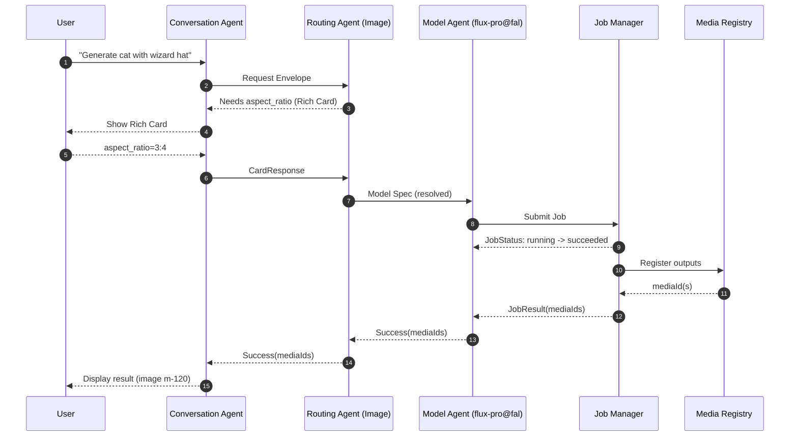
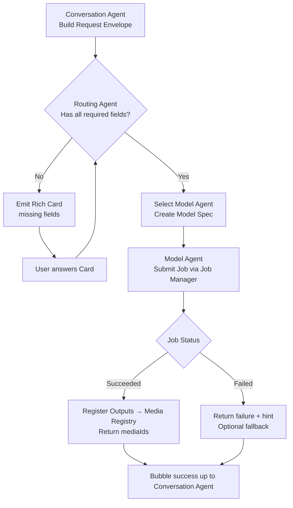

# AI Agent Architecture Plan
**Date:** August 12, 2025

This document refines the agent plan and adds concrete contracts and diagrams so it can be implemented directly in an iOS app using an LLM front end and model APIs (OpenAI, Fal.ai, etc.).

---

## 1) Design Goals
- **Single front door:** The Conversation Agent is the only entity that interacts with the user directly.
- **Clear routing:** Conversation Agent delegates to **Routing Agents** which may delegate to other routing layers or to **Model Agents** (leafs).
- **Media by ID:** All media (uploaded, generated, edited) is addressed by registry ID; large payloads never travel through the LLM.
- **Traceable jobs:** Every model call is a **Job** with correlation IDs, status, and durable logs.
- **Human-in-the-loop (HITL):** Any agent can request missing info by emitting a **Rich Card**; user answers are routed back to the requesting agent.
- **Extensibility:** Adding a model is adding one Model Agent + schema; routing logic remains stable.
- **Robustness-first:** Errors are explicit, recoverable, and surfaced to the user with next steps.

---

## 2) Core Entities & Responsibilities

### 2.1 Conversation Agent (UI-facing)
- Parses user intent and context (including recent messages and media references).
- Builds a **Request Envelope** and invokes a **Routing Agent tool**.
- Displays progress and final results; posts Rich Cards to chat when requested by child agents.
- Correlates user responses from Rich Cards back to the originating agent via **conversationId** + **cardId**.

**Inputs:**
- User messages, media selections, prior context.

**Outputs:**
- Tool calls to routing agents, UI messages, media previews.

---

### 2.2 Routing Agent (intermediate)
- Decides which child agent/tool to call next based on the **Task Descriptor**.
- May emit a Rich Card if required fields are missing or ambiguous.
- Transforms generic requests into model-ready specs, or forwards to another routing agent.

**Inputs:**
- Request Envelope from parent agent.

**Outputs:**
- Tool calls to Routing or Model Agents; Rich Cards for missing info; success/failure up-chain.

---

### 2.3 Model Agent (leaf)
- Owns the mapping from **Model Spec** to **HTTP payload** (provider-specific).
- Submits a **Job** via the Job Manager (queue endpoint, e.g., Fal.ai queue).
- Receives completion callback/status, registers outputs, returns success (media IDs) or failure (error code + hint).

**Inputs:**
- Fully-resolved Model Spec + media IDs.

**Outputs:**
- Job submission, eventual success with output media IDs or failure details.

---

### 2.4 Job Manager (service)
- Submits jobs, polls/receives status, handles retries/backoff.
- Normalizes provider responses into **JobStatus**.
- On completion: stores artifacts, registers media, and notifies the caller (Model Agent) with a **JobResult**.

**Inputs/Outputs:**
- Provider APIs (Fal.ai queue, OpenAI images, etc.), storage, Media Registry.

---

### 2.5 Media Registry (service)
- Assigns **mediaId** for uploads, model outputs, and edits.
- Stores metadata (mime, dims, duration, description, source job, checksums).
- Provides signed URLs or local file handles for retrieval.

---

### 2.6 Rich Card (UI object)
- Minimal request recap + explicit missing fields.
- Includes compact UI controls (text, number, dropdown, radio, image/mask picker, etc.).
- On submit: returns a **CardResponse** to the originating agent.

---

## 3) Message & Data Contracts (concise)

### 3.1 Request Envelope
```json
{
  "conversationId": "c-123",
  "requestId": "r-456",
  "userIntent": "generate a photorealistic cat wearing a wizard hat",
  "context": {
    "language": "en",
    "tone": "neutral"
  },
  "mediaRefs": [
    {"mediaId": "m-42", "role": "background"},
    {"mediaId": "m-77", "role": "mask"}
  ],
  "taskDescriptor": {
    "category": "image.generation",
    "quality": "high",
    "constraints": {"resolution": "1024x1024", "style": "photorealistic"}
  }
}
```

### 3.2 Rich Card Request (from any agent to Conversation Agent)
```json
{
  "cardId": "card-001",
  "conversationId": "c-123",
  "originAgentPath": ["conversation", "image-routing", "flux-pro@fal"],
  "summary": "Generate a photorealistic cat with a wizard hat",
  "missing": [
    {"field": "hat_color", "type": "enum", "options": ["blue", "red", "black"]},
    {"field": "aspect_ratio", "type": "enum", "options": ["1:1", "3:4", "16:9"]}
  ]
}
```

### 3.3 Rich Card Response (from UI back to origin agent)
```json
{
  "cardId": "card-001",
  "conversationId": "c-123",
  "answers": {
    "hat_color": "blue",
    "aspect_ratio": "3:4"
  }
}
```

### 3.4 Job Submission (Model Agent → Job Manager)
```json
{
  "jobId": "j-789",
  "provider": "fal",
  "endpoint": "fal-ai/flux-pro/v1.1",
  "payload": {
    "prompt": "photorealistic cat with a blue wizard hat",
    "image_size": "768x1024",
    "seed": 1234,
    "image": {"mediaId": "m-42"},
    "mask": {"mediaId": "m-77"}
  },
  "webhook": "app://jobs/callback/j-789"
}
```

### 3.5 Job Status (normalized)
```json
{
  "jobId": "j-789",
  "status": "succeeded | running | queued | failed | cancelled",
  "progress": 0.0,
  "etaSeconds": 25,
  "error": null
}
```

### 3.6 Job Result → Media Registration
```json
{
  "jobId": "j-789",
  "artifacts": [
    {
      "kind": "image",
      "uri": "https://storage/outputs/abc.png",
      "metadata": {"width":1024,"height":1024},
      "mediaId": "m-120"
    }
  ]
}
```

---

## 4) Control Flow (happy path)

1. **User → Conversation Agent:** “Generate a photorealistic cat wearing a wizard hat.”
2. Conversation Agent builds Request Envelope and calls **Image Routing Agent**.
3. Image Routing Agent resolves defaults; if needed, emits a **Rich Card** (e.g., aspect ratio).
4. User answers the card; Conversation Agent routes **CardResponse** to Image Routing Agent.
5. Image Routing Agent selects **Model Agent** (e.g., `flux-pro@fal`) and passes a **Model Spec**.
6. Model Agent builds provider payload and calls **Job Manager**.
7. Job Manager submits, polls, completes; registers outputs in **Media Registry**.
8. Model Agent returns **Success(mediaIds)**; chain bubbles up to Conversation Agent.
9. Conversation Agent displays result and allows follow-up actions (edit, animate, etc.).

---

## 5) Error & Recovery Patterns

- **Missing fields:** Agent emits Rich Card; user fills in; retry.
- **Model failure:** Return `{failed, reason, hint}`; parent may auto-fallback to another model if policy allows.
- **Timeout:** Job Manager cancels and surfaces a retry card.
- **Invalid mediaRef:** Conversation Agent prompts user to re-select media; offers registry browser.
- **Concurrency/cross-talk:** All cards and requests carry `conversationId`, `requestId`, and `originAgentPath` to ensure answers route to the correct agent instance.

---

## 6) Observability & IDs

- `conversationId`, `requestId`, `cardId`, `jobId`, `mediaId` are **globally unique** (ULIDs).
- Structured logs on agent boundaries with the above IDs.
- Job Manager exposes a queryable history for audits and debugging.

---

## 7) Security & Privacy

- Media served via signed URLs or secure local handles.
- No raw media in LLM prompts; use IDs + short descriptions.
- PII redaction before logs; media never dumped to logs.

---

## 8) Extensibility Checklist (add a new model)

1. Implement a **Model Agent** with: supported tasks, input schema, param mapping.
2. Add provider payload builder + validation.
3. Register endpoints/quotas in configuration.
4. Add minimal UI: parameter sheet for that model.
5. Extend routing rules to reference the new agent.

---

## 9) Diagrams (Mermaid)

### 9.1 Sequence (end-to-end, with HITL)


### 9.2 Flowchart (routing and HITL loop)


---

## 10) Items that might need clarification

- **Routing policy:** Explicit rules vs. LLM heuristic vs. hybrid? (Recommend: hybrid with guardrails and caps.)
- **Fallbacks:** When a model fails/limits hit, which alternates are allowed automatically?
- **Parameter defaults:** Centralized schema (per task) vs. model-local defaults?
- **Rate limits/quotas:** Per-provider budgets and backoff strategy (Job Manager).
- **Callback vs. polling:** Prefer webhooks when available; otherwise 10s polling cadence.

---

## 11) Minimal iOS Integration Notes (SwiftUI + SwiftData)

- **Conversation Agent** lives in the ChatViewModel; emits tool calls.
- **Routing/Model Agents** defined as structs with `handle(request: RequestEnvelope)` returning `AgentResult`.
- **Job Manager** as an `actor` with a task map; polling every 10s (configurable).
- **Media Registry** backed by SwiftData for metadata and file URLs in app sandbox.
- **Rich Cards** are lightweight SwiftUI views with a `cardId` and `onSubmit(answers:)` callback.
- Debug: structured logs keyed by `conversationId/requestId/jobId/mediaId` (but never dump media bytes).

---

_End of document._
