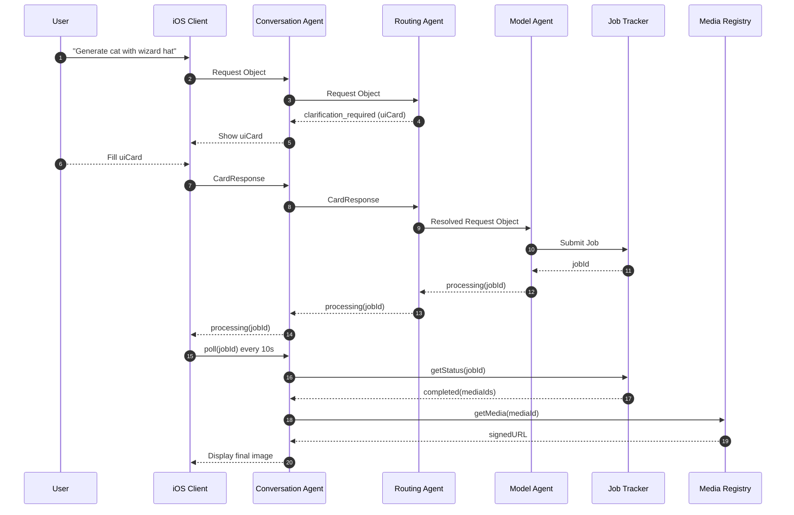

# AI Agent System – Final Specification
**Date:** August 12, 2025  
**Version:** 2.0 (Merged Plan)

This document merges the best aspects of the two previous designs:  
- Backend‑centric, structured JSON request objects, dynamic UI cards, async job tracker (from Plan B).  
- Strong ID correlation, routing/fallback policies, minimal history, concurrency safety (from Plan A).  
- Security, observability, and extensibility best practices.

---

## 1. Core Design Principles
- **Single front door:** Conversation Agent handles all user interaction.
- **Structured payloads:** All inter‑agent calls use a **Request Object** with well‑defined fields, not free‑form strings.
- **Media by ID:** All media is addressed by `mediaId`; LLM never receives raw media bytes.
- **Asynchronous job handling:** Jobs have IDs, tracked in Job Tracker; iOS polls backend status endpoint initially; webhooks added later.
- **Rich Cards:** Standardized `clarification_required` response with dynamic UI schema + strict routing IDs (`cardId`, `originAgentPath`).
- **Routing policy:** Hybrid LLM heuristic + explicit rule table; guardrails prevent mis‑routing; model fallback policies defined.
- **Security/observability:** Signed URLs, checksums, structured logs with correlation IDs, never log raw media.
- **Backend orchestrator:** All agents and job tracking live server‑side for scale, security, and multi‑platform support.

---

## 2. Communication Protocol

### 2.1 Request Object
```json
{
  "conversationId": "c-123",
  "requestId": "r-456",
  "originAgentPath": ["conversation", "image-routing"],
  "intent": "image_generation_realistic",
  "taskDescription": "User wants a photorealistic image of their cat, fluffy, sitting on a red velvet couch in a victorian-style room.",
  "parameters": {
    "style": "photorealistic",
    "subject": "cat, fluffy",
    "setting": "red velvet couch, victorian room"
  },
  "mediaReferences": [
    {"mediaId": "m-42", "role": "subject_reference"}
  ],
  "history": [
    "user: Make a pic of my cat",
    "agent: Sure! What's the setting?",
    "user: A victorian room on a couch"
  ]
}
```
- `history` is **trimmed** to relevant turns.
- `originAgentPath` ensures responses go back to the exact requesting agent instance.

---

## 3. Rich Card Protocol

### 3.1 Clarification Required Response
```json
{
  "status": "clarification_required",
  "originalRequestId": "r-456",
  "cardId": "card-001",
  "conversationId": "c-123",
  "originAgentPath": ["conversation", "image-routing", "flux-pro@fal"],
  "uiCard": {
    "title": "Need More Details!",
    "description": "To create the best image, please specify the following:",
    "elements": [
      {
        "type": "text_input",
        "label": "What style of art?",
        "id": "style_input",
        "placeholder": "e.g., cartoon, watercolor, anime"
      },
      {
        "type": "select_menu",
        "label": "Image Aspect Ratio",
        "id": "aspect_ratio_select",
        "options": ["1:1", "16:9", "9:16"]
      }
    ],
    "submitButtonText": "Update & Generate"
  }
}
```

### 3.2 Rich Card Response
```json
{
  "cardId": "card-001",
  "conversationId": "c-123",
  "answers": {
    "style_input": "watercolor",
    "aspect_ratio_select": "16:9"
  }
}
```

---

## 4. Job Handling Protocol

### 4.1 Processing Response (immediate feedback)
```json
{
  "status": "processing",
  "jobId": "job-uuid-12345",
  "message": "Your image is being generated! I'll let you know when it's ready."
}
```

### 4.2 Job Status Endpoint Response
```json
{
  "jobId": "job-uuid-12345",
  "status": "completed",
  "mediaIds": ["m-120"],
  "progress": 1.0
}
```

---

## 5. Key Components

- **iOS Client:** Renders chat, uploads media, renders `uiCard` dynamically, polls backend for job status.
- **Backend Agent Orchestrator:** Hosts Conversation, Routing, and Model Agents; enforces routing/fallback rules.
- **Routing Agent:** Determines which Model Agent to call; may request clarification.
- **Model Agent:** Converts resolved request into provider API payload.
- **Job Tracker:** Manages async jobs; polling (initial), webhooks (future); persists job state.
- **Media Registry:** Maps `mediaId` to storage location, metadata, checksums.

---

## 6. Routing & Fallback Policy
Example (simplified table):
| Task Category         | Primary Model          | Fallback Model       |
|-----------------------|-----------------------|----------------------|
| image.generation      | fal-ai/flux-pro/v1.1  | openai/dalle-3       |
| video.generation      | fal-ai/kling-video/v2 | fallback-none        |
| image.inpainting      | fal-ai/flux-inpaint   | stability/stable-diffusion-xl |

---

## 7. Security & Observability
- Signed URLs for media.
- Checksums for integrity.
- Never log raw media.
- All logs include `conversationId`, `requestId`, `cardId`, `jobId`, `mediaId`.
- Audit trails stored server‑side.

---

## 8. End-to-End Sequence Diagram


---

## 9. Flowchart
```mermaid
flowchart TD
    A[Conversation Agent Receives User Request] --> B{Routing Agent
Has all required info?}
    B -- No --> C[Emit clarification_required with uiCard]
    C --> D[User fills uiCard in iOS]
    D --> B
    B -- Yes --> E[Select Model Agent]
    E --> F[Submit job to Job Tracker]
    F --> G[processing(jobId) returned to user]
    G --> H[Poll Job Tracker for status]
    H -->|completed| I[Register outputs in Media Registry]
    I --> J[Return mediaIds to user]
```

---

## 10. Extensibility Checklist
1. Define new Model Agent with schema + provider mapping.
2. Add to routing/fallback table.
3. Update UI parameter sheets if needed.
4. Test full cycle: request → clarification → job → media.

---

_End of merged specification._
