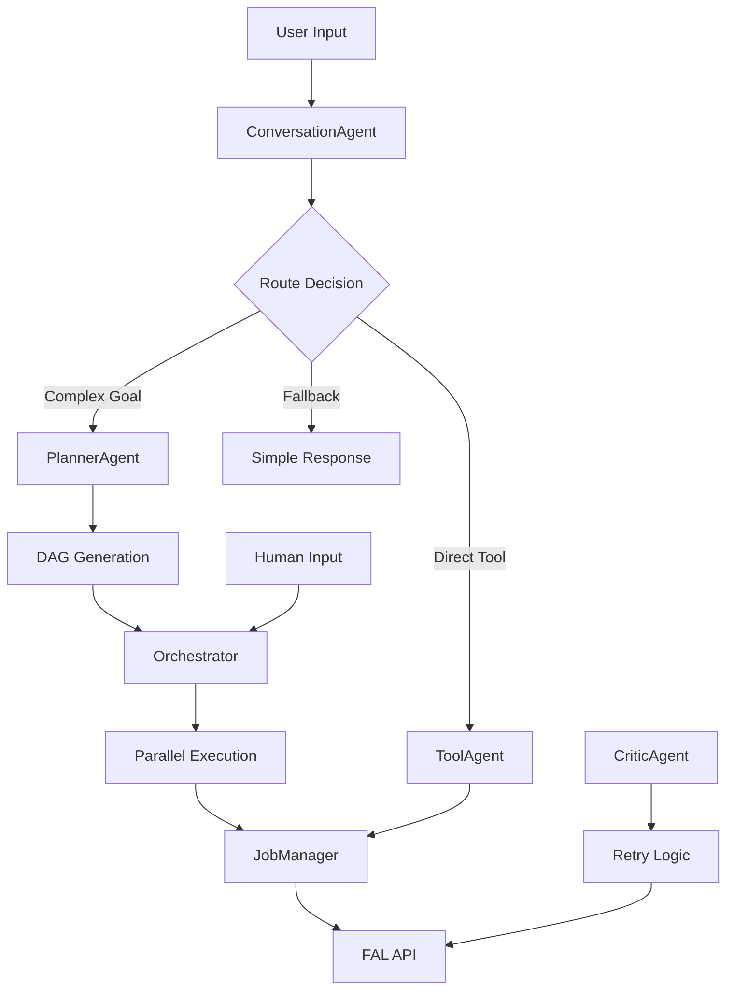
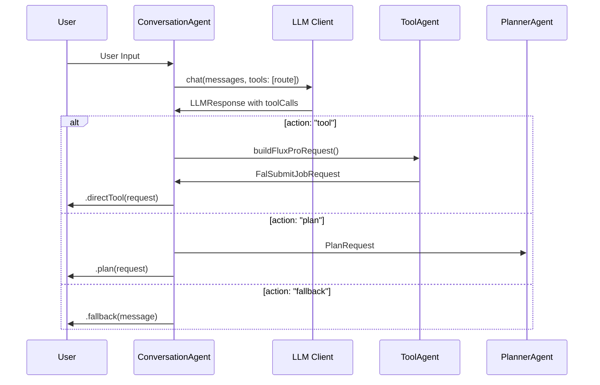
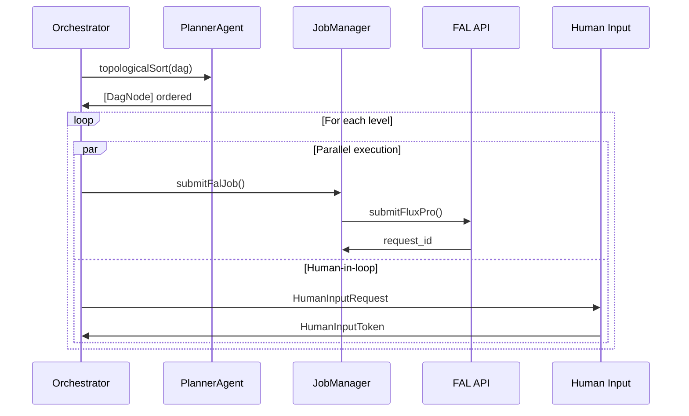
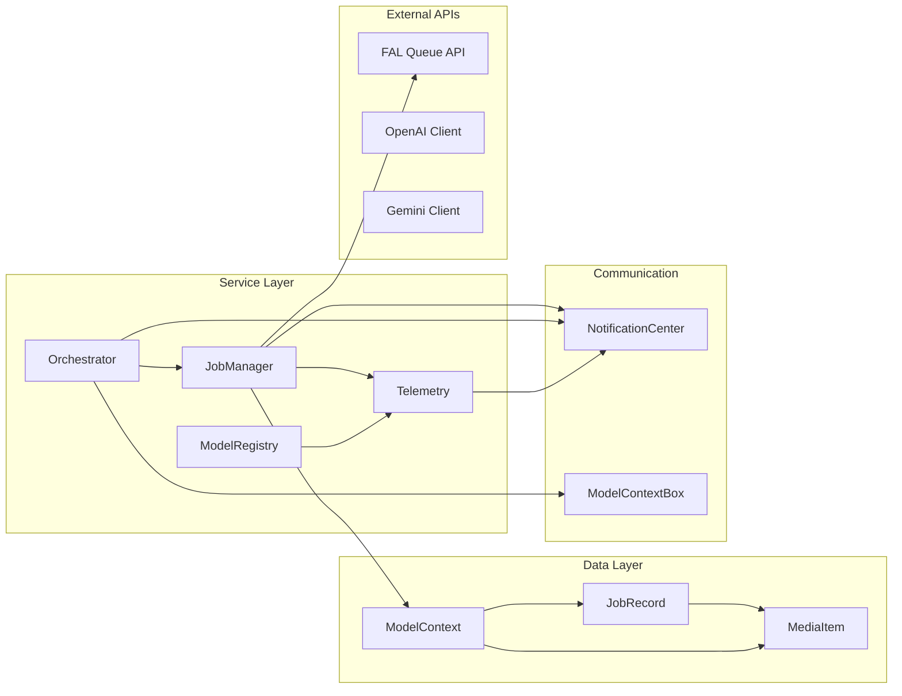
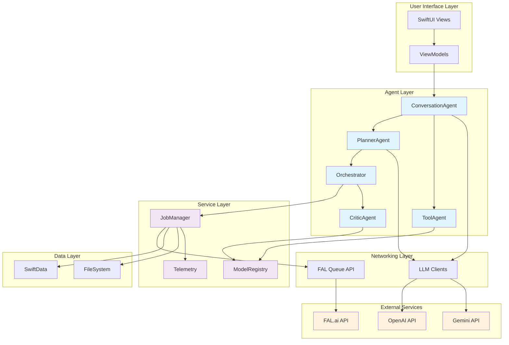

# AI Agent & Tool-Calling Architecture Analysis
## Create Agent 3

### Executive Summary

Create Agent 3 implements a sophisticated multi-agent architecture for AI-powered image generation and editing workflows. The system features 5 core agents orchestrating tool calls through LLM providers (OpenAI/Gemini) and external APIs (FAL), with robust concurrency, retry mechanisms, and human-in-the-loop capabilities.

---

## 1. Agent Inventory & Responsibilities

| Agent | File | Primary Responsibility | Context |
|-------|------|----------------------|---------|
| **ConversationAgent** | `Services/ConversationAgent.swift` | Route user input to appropriate tools or planning workflows | Entry point for all user interactions |
| **PlannerAgent** | `Services/PlannerAgent.swift` | Generate DAG-based execution plans from user goals | Complex task decomposition with dependency management |
| **ToolAgent** | `Services/ToolAgent.swift` | Build validated tool requests for image generation/editing | Parameter validation and model selection |
| **CriticAgent** | `Services/CriticAgent.swift` | Handle retry logic with alternate model selection | Failure recovery and model fallback |
| **Orchestrator** | `Services/Orchestrator.swift` | Execute plans with concurrency control and human-in-loop | Actor-based execution engine |

### Agent Operational Context



---

## 2. Tool Call Definitions & Schemas

### 2.1 LLM Tool Calling Framework

**Base Infrastructure** (`Networking/LLM/LLMClient.swift`):
```swift
public struct LLMTool: Codable {
    public let name: String
    public let description: String?
    public let parametersJSONSchema: [String: AnyCodable]?
}

public struct LLMToolCall: Codable, Equatable {
    public let name: String
    public let argumentsJSON: String
}
```

### 2.2 ConversationAgent Tool Schema

**Tool Name**: `route`
**Purpose**: Decide between direct tool execution, planning, or fallback response

**Input Schema**:
```json
{
  "type": "object",
  "properties": {
    "action": {
      "type": "string",
      "enum": ["tool", "plan", "fallback"]
    },
    "model": {"type": "string"},
    "prompt": {"type": "string"},
    "width": {"type": "integer"},
    "height": {"type": "integer"},
    "title": {"type": "string"},
    "goal": {"type": "string"},
    "message": {"type": "string"}
  },
  "required": ["action"]
}
```

**Trigger Conditions**: Every user input
**Model Configuration**: Uses injected `LLMClient` (OpenAI/Gemini)

### 2.3 PlannerAgent Tool Schema

**Tool Name**: `generate_dag`
**Purpose**: Generate Directed Acyclic Graph of tasks

**Input Schema**:
```json
{
  "type": "object",
  "properties": {
    "nodes": {
      "type": "array",
      "items": {
        "type": "object",
        "properties": {
          "id": {"type": "string"},
          "title": {"type": "string"},
          "description": {"type": "string"},
          "needs": {
            "type": "array",
            "items": {"type": "string"}
          },
          "provides": {
            "type": "array", 
            "items": {"type": "string"}
          }
        },
        "required": ["id", "title", "description"]
      }
    },
    "edges": {
      "type": "array",
      "items": {
        "type": "object",
        "properties": {
          "from": {"type": "string"},
          "to": {"type": "string"},
          "label": {"type": "string"}
        },
        "required": ["from", "to"]
      }
    }
  },
  "required": ["nodes"]
}
```

**Trigger Conditions**: Complex goals requiring multi-step execution
**Model Configuration**: Uses injected `LLMClient` with system prompt for task planning

### 2.4 FAL API Tool Integrations

**Flux Pro v1.1** (Image Generation):
```swift
struct Input: Codable {
    let prompt: String
    let width: Int?
    let height: Int?
    var num_inference_steps: Int?
    var guidance_scale: Double?
    var output_format: String?
    var num_images: Int?
}
```

**Flux Pro Kontext Max** (Image Editing):
```swift
struct Input: Codable {
    let prompt: String
    let image_url: String
    var guidance_scale: Double?
    var num_images: Int?
    var output_format: String?
    var seed: Int?
    var safety_tolerance: String?
    var sync_mode: Bool?
}
```

---

## 3. Agent-Tool Invocation Flow

### 3.1 Conversation Routing Flow



### 3.2 Plan Execution Flow



### 3.3 Orchestration Logic

**Key Features**:
- **Level-based execution**: DAG nodes executed in topological order by dependency levels
- **Concurrency control**: `maxConcurrentJobs` parameter limits parallel execution
- **Human-in-the-loop**: Suspends execution for unmet dependencies, resumes with human tokens
- **Token flow tracking**: Manages `availableTokens` and `nodeProvidedTokens` across levels

**Data Transformations**:
1. `PlanRequest` → `DAG` (via LLM tool call)
2. `DagNode` → `FalSubmitJobRequest` (via ToolAgent)
3. `FalSubmitJobRequest` → `JobRecord` (via JobManager)
4. `JobRecord` → `MediaItem` (upon completion)

---

## 4. Shared Resources & Dependencies

### 4.1 Resource Relationship Map



### 4.2 Key Shared Resources

| Resource | Type | Purpose | Consumers |
|----------|------|---------|-----------|
| **ModelContext** | SwiftData | Persistent storage | JobManager, Orchestrator |
| **ModelContextBox** | Thread-safe wrapper | Actor boundary crossing | JobManager, Orchestrator |
| **NotificationCenter** | Event bus | Cross-component communication | All agents, UI components |
| **ModelRegistry** | Service | Model selection & configuration | ToolAgent, CriticAgent |
| **JobManager** | Actor | Job lifecycle management | Orchestrator, UI |
| **FAL Queue API** | HTTP client | External tool execution | JobManager |

---

## 5. Extension Points & Patterns

### 5.1 Agent Extension Pattern

**Protocol-based design**:
```swift
public protocol PlannerAgentProtocol {
    func makePlan(from request: PlanRequest) async throws -> Plan
}
```

**Dependency injection**:
```swift
public init(llm: LLMClient?) { self.llm = llm }
```

### 5.2 Model Registry Pattern

**Task-based categorization**:
```swift
public enum TaskType: String, CaseIterable, Codable, Hashable {
    case imageGeneration
    case imageEditing
}
```

**Pluggable storage backends**:
- `UserDefaultsModelSettingsStore`
- `InMemoryModelSettingsStore`

### 5.3 Retry & Fallback Patterns

**CriticAgent alternate selection**:
```swift
func pickAlternateModelId(for task: TaskType, excluding primaryId: String) -> String?
```

**Graceful degradation**:
- LLM unavailable → heuristic routing
- Primary model fails → alternate model selection
- Network errors → exponential backoff retry

### 5.4 Extension Points for New Agents

1. **Implement agent protocol** (if available)
2. **Inject dependencies** via constructor
3. **Register with orchestrator** if needed
4. **Add tool schemas** to LLM clients
5. **Extend model registry** for new task types

---

## 6. Architecture Patterns & Abstractions

### 6.1 Key Design Patterns

| Pattern | Implementation | Benefits |
|---------|----------------|----------|
| **Actor Model** | `JobManager`, `Orchestrator` | Thread-safe concurrency |
| **Dependency Injection** | Constructor-based | Testability, flexibility |
| **Strategy Pattern** | `ModelSettingsStore` variants | Pluggable persistence |
| **Observer Pattern** | `NotificationCenter` events | Loose coupling |
| **Command Pattern** | `FalSubmitJobRequest` | Request encapsulation |
| **State Machine** | `JobState` enum | Clear state transitions |

### 6.2 Architectural Abstractions

**Non-Sendable Boxing**:
```swift
public typealias ModelContextBox = NonSendableBox<ModelContext>
```

**Unified Error Handling**:
```swift
enum ToolAgentError: Error, LocalizedError
enum JobManagerError: Error, LocalizedError
enum FalAPIError: Error, LocalizedError
```

**Logging Abstraction**:
```swift
public protocol LogRedactable {
    var redactedDescription: String { get }
}
```

---

## 7. Risk Analysis & Inconsistencies

### 7.1 Identified Risks

| Risk Category | Issue | Impact | Mitigation |
|---------------|-------|--------|------------|
| **Concurrency** | Actor state mutations in closures | Data races | Use `@Sendable` functions, capture dependencies |
| **Error Handling** | Inconsistent error propagation | Poor UX | Standardize error types and handling |
| **Resource Leaks** | NotificationCenter observers | Memory leaks | Proper cleanup in deinit |
| **API Dependencies** | Hard-coded FAL endpoints | Brittleness | Configuration-based URLs |
| **State Consistency** | Multiple sources of truth | Data inconsistency | Centralized state management |

### 7.2 Inconsistencies Found

1. **Mixed error handling approaches**: Some agents throw, others return optionals
2. **Inconsistent logging levels**: Debug vs Info vs Error usage varies
3. **Model ID hardcoding**: Some model IDs are hardcoded vs registry-based
4. **Async/await mixing**: Some legacy callback patterns remain

### 7.3 Recommendations

1. **Standardize error handling** across all agents
2. **Implement circuit breaker** for external API calls
3. **Add comprehensive logging** with structured metadata
4. **Create agent lifecycle management** for proper cleanup
5. **Implement request/response validation** schemas
6. **Add metrics collection** for performance monitoring

---

## 8. Visual Architecture Diagram



---

## Gaps & Risks (from Operational Review)
- Planning path not wired: `.plan(PlanRequest)` is not executed (missing call to `PlannerAgent.makePlan` and `Orchestrator.execute`).
- Model settings inconsistency: `ToolAgent` uses `InMemoryModelSettingsStore` by default, while settings UI and others use `UserDefaultsModelSettingsStore`.
- Unused `ModelPicker`: present but not integrated.
- Minimal retry policy in Orchestrator; no backoff classification.
- Human-in-loop state is in-memory only (lost across app restarts).
- All DAG nodes assume image generation tool; future multi-tool nodes need dispatching logic.

## Actionable Recommendations (Merged)
1) Wire the plan path in `ChatViewModel` for `.plan` → make plan → execute.
2) Unify model settings storage in `ToolAgent` to `UserDefaultsModelSettingsStore`.
3) Consider adopting `ModelPicker` to honor capabilityTags.
4) Add per-node tool typing or capability tags in `DagNode` to route tools.
5) Optional: Add a telemetry viewer or sink for `.telemetry`.

## Analysis Metadata

- **Generated**: 2025-08-10T15:15:23-07:00
- **Codebase**: Create Agent 3 (Swift/iOS)
- **Analysis Scope**: AI agents, tool-calling architecture, orchestration patterns
- **Files Analyzed**: 25+ core service and model files
- **Architecture Patterns**: Multi-agent, Actor model, Dependency injection, Observer pattern

This architecture analysis provides a comprehensive view of Create Agent 3's AI agent and tool-calling system, highlighting its sophisticated multi-agent orchestration capabilities, robust error handling, and extensible design patterns.
